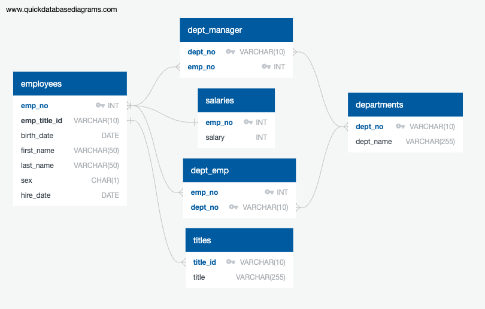

# SQL Challenge: Pewlett Hackard Employee Database  

## Table of Contents  
- [Project Overview](#project-overview)  
- [Key Design Features](#key-design-features)  
- [Data Engineering](#data-engineering)  
  - [Database and Table Creation](#1-database-and-table-creation)  
  - [Data Import](#2-data-import)  
- [Data Analysis](#data-analysis) 

## Project Overview  
This project involves analyzing the employee data of Pewlett Hackard, a fictional company, from the 1980s and 1990s. The available dataset consists of six CSV files containing employee, department, and salary information. The project is structured into three key phases:  

1. **Data Modeling** – Designing an Entity Relationship Diagram (ERD) and defining the database schema.  
2. **Data Engineering** – Creating the database and tables, then importing the CSV data.  
3. **Data Analysis** – Writing SQL queries to extract insights from the dataset.  
___

### **Key Design Features**
1. **Primary Keys:** 
   - Each table has a uniquely identifying column (`emp_no`, `dept_no`, `title_id`).
2. **Foreign Keys:** 
   - `emp_title_id` in `employees` references `titles` to ensure employees have valid job titles.
   - `emp_no` in `salaries` references `employees`, ensuring every salary entry belongs to a valid employee.
   - `dept_no` in `dept_emp` and `dept_manager` ensures valid department assignments.
3. **Many-to-Many Relationships:**
   - `dept_emp` enables employees to be associated with multiple departments.
   - `dept_manager` tracks managers of different departments.
4. **Cascade Deletion (`ON DELETE CASCADE`):**
   - When an employee is removed, their salary, department assignments, and management roles are also deleted automatically.

The ERD clearly shows the relationships of the database.

---

## Data Engineering  
### 1. Database and Table Creation  
- The [**employees_schema.sql**](employees_schema.sql) file contains the SQL commands to create tables with appropriate data types, primary keys, foreign keys, and constraints.  
- Tables were created in a structured order to prevent foreign key conflicts.  

### 2. Data Import  
- The **CSV files** are located in the [**EmployeeSQL**](EmployeeSQL) folder.  
- Each CSV file was imported into its respective table in the correct order to maintain data integrity.

---

## Data Analysis  
After successfully importing the data, SQL queries were executed to answer the following business questions:

1. List all employees with their salaries.  
2. Employees hired in 1986.  
3. Department managers with employee details.  
4. Department details for each employee.  
5. Employees named 'Hercules' with a last name starting with 'B'.  
6. Employees working in the Sales department.  
7. Employees working in Sales and Development departments.  
8. Frequency counts of common last names.  

The [**employees_queries.sql**](employees_queries.sql) file contains all the queries used to analyze the data.